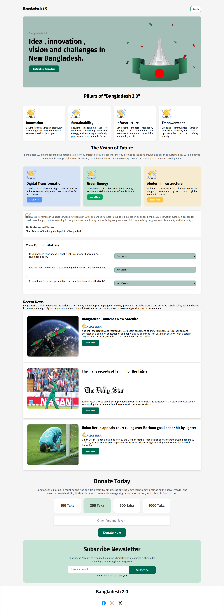

# Bangladesh 2.0

A modern, responsive landing page project showcasing the vision, innovation, and progress of Bangladesh.  
**Live Demo:** [Bangladesh 2.0](https://bangladesh-2-0-b11-a1.vercel.app/)

---

## 🚀 Project Overview

**Bangladesh 2.0** is a conceptual web project highlighting the pillars of a new, progressive Bangladesh. The site features:

- **Modern UI/UX:** Clean, responsive design using only HTML and CSS.
- **Key Sections:**
  - Hero Banner
  - Pillars of Bangladesh
  - Vision of the Future
  - Recent News
  - Donation & Newsletter
  - Opinion Polls
  - Inspirational Quotes
  - Social Media Footer

---

## 🛠️ Tech Stack

- **HTML5**
- **CSS3**
- **Google Fonts**

No frameworks or JavaScript used.

---

## 📸 Screenshots

---

## ✨ Features

- **Fully Responsive:** Works on all devices (mobile, tablet, desktop)
- **Accessible & Semantic HTML**
- **Interactive Elements:** Opinion polls, donation, and newsletter sections
- **Modern Aesthetics:** Consistent color palette and typography

---

## 📦 Getting Started

1. **Clone the repository:**
2. **Open `index.html` in your browser.**

No build steps required.

---

## 🤝 Contributing

Pull requests are welcome! For major changes, please open an issue first to discuss what you would like to change.

---

**Made with ❤️ by [Aysa Siddika Meem]**
